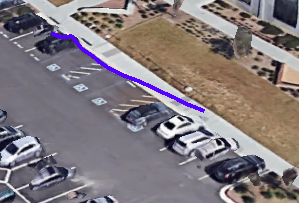
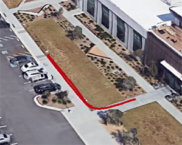
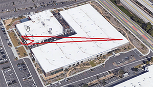
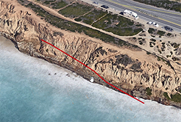
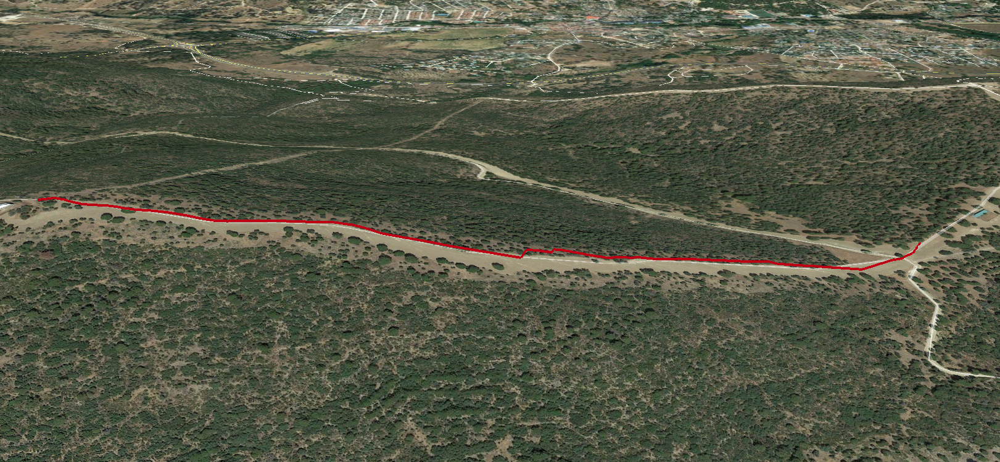

# Updates

* Added support for CSV export format. Now it's created along the gpx and kml formats.
* Added support for Gopro13 (labels: `'CSCM', 'PRJT', 'LOGS', 'GPS '`).
* Fixed the non-unicode fourCC labels with `ERRU` label (empty).
* Added support for 18Hz resolution in `GPS5` fourCC, to fix (#PR23,#PR17)[https://github.com/juanmcasillas/gopro2gpx/pull/24]. Thanks to (JimmyS83)[https://github.com/JimmyS83] for spot the problem.
* Fixed a new problem with the version strings, thanks to (hdnh2006)[https://github.com/hdnh2006].
* Fixed a problem in stream['id'] using stream['index'] instead. Thanks to (hdnh2006)[https://github.com/hdnh2006] for spot the problem.
* Added support for "new" and "old" version strings for `ffmpeg`:

```python
#
# manage old format, and new formats here. Examples
#
# ffmpeg version N-109745-g7d49fef8b4 Copyright (c) 2000-2023 the FFmpeg developers
# Version(major=4, medium=109745, minor=0)
# ffmpeg version N-109674-gc0bc804e55-20230127 Copyright (c) 2000-2023 the FFmpeg developers
# Version(major=109674, medium='gc0bc804e55', minor=20230127)
# ffmpeg version 2023-01-25-git-2c3107c3e9-essentials_build-www.gyan.dev Copyright (c) 2000-2023 the FFmpeg developers
# Version(major=2023, medium=1, minor=25)
# ffmpeg version 4.3.1 Copyright (c) 2000-2020 the FFmpeg developers
# Version(major=4, medium=3, minor=1)
# ffmpeg version 2.1.3 Copyright (c) 2000-2020 the FFmpeg developers
# Version(major=2, medium=1, minor=3)
```


* Added support for legacy versions of ffmpeg. If ffmpeg version is lower than 4.4 use the standard output format; else, uses the json format (contributed by [alycda](https://github.com/juanmcasillas/gopro2gpx/issues/13#issuecomment-832080667)).
* Fixed regexp to support new formats (contributed by [sbwilli3](https://github.com/juanmcasillas/gopro2gpx/issues/13#issuecomment-1136660302))
* Added label 'FSKP' (contributed by [designer2k2](https://github.com/juanmcasillas/gopro2gpx/issues/20#issue-942464545))

# About gopro2gpx

Python script that parses the gpmd stream for GOPRO moov track (MP4) and extract the GPS info into a GPX (and kml) file.

Tested on a GoPro7, but it should work on any camera above the GoPro5.

Tested on Windows7 and MacOS Sierra.

I always like to print some additional info overlaying my action videos. These overlays will show data about speed, elevation,
gps info, and so on. I started a project wrotten on python 2.7 that works fine. gets a `gpx` track file, a `mp4` file and some
configuration, and builds an overlay with the data:

* [Python Overlay 1.0](https://www.youtube.com/watch?v=Fg8Sf4fPCwY)
* [Python Overlay 2.0](https://www.youtube.com/watch?v=SGQ2KWcBtwY)

Recently, I bought a Gopro7 black, that supports GPS inside the camera. Gopro's [Quik](https://es.shop.gopro.com/softwareandapp/quik-%7C-desktop/Quik-Desktop.html)
allows you to process the metadata stored along the videos, and show it as an overlay. I want to extract the data from the `MP4` file, so I start to read about in
the web. The data is stored in a format called **GPMF*, you can get all the info in this repo [https://github.com/gopro/gpmf-parser](https://github.com/gopro/gpmf-parser).
Also, there are some implementations in **go**. Check this repo [https://github.com/stilldavid/gopro-utils/](https://github.com/stilldavid/gopro-utils/).

My idea is process the file in python, extract the data, and build a file in a known format. I generate *kml* and *gpx*.

# Dependencies

* [Python3](https://www.python.org/download/releases/3.0/)
* [FFmpeg and FFprobe binaries](https://www.ffmpeg.org/download.html)
* Valid MP4 with GPS data inside. Record something with your cam.

# Installation

1. Package installation: there are two ways to install the package:

   a) Install via pip (with git installed):

   ```
   pip install git+https://github.com/juanmcasillas/gopro2gpx
   ```

   b) *Or* Download the repository, unpack it and install with

   ```
   python -m pip install .
   ```

2. Ensure you have **FFmpeg** and **FFprobe** installed in your system.

3. If ffmpeg is not installed in a `PATH` location, the path can be specified in the config file.

   The configuration file is located in:

   - Windows: `%APPDATA%\gopro2gpx\gopro2gpx.conf`
   - Unix (Linux, Mac): `$HOME/.config/gopro2gpx.conf` (`$XDG_CONFIG_HOME/gopro2gpx.conf` to be exact)

   The configuration file has to look like this:

   ```
   [ffmpeg]
   ffmpeg = /path/to/ffmpeg
   ffprobe = /path/to/ffprobe
   ```

4. The script can then be invoked with

   ```shell
   gopro2gpx
   ```

   or

   ```shell
   python3 -m gopro2gpx
   ```

   (exchange `python3` with your specific python installation)

   E.g. to run it on the example data (skip bad points, show the labels debug, create `hero6.kml` and `hero6.gpx` files):

   ```shell
   gopro2gpx -s -vvv samples/hero6.mp4 hero6
   ```

5. With custom path for FFMPEG

   ```
   export PATH=$PATH:/usr/local/opt/ffmpeg/bin
   gopro2gpx -vvv samples/8/GH010159.MP4 output.bin
   ```

# Arguments and options

```
% python gopro2gpx.py  --help
usage: gopro2gpx.py [-h] [-v] [-b] [-s] file outputfile

positional arguments:
  file           Video file or binary metadata dump
  outputfile     output file. builds KML and GPX

optional arguments:
  -h, --help     show this help message and exit
  -v, --verbose  increase output verbosity
  -b, --binary   read data from bin file
  -s, --skip     Skip bad points (GPSFIX=0)
```

* `file`: Gopro MP4 file or binary file with the gpmd dump.
* `outputfile`: Dump the GPS info into `outputfile.kml` and `outputfile.gpx`. Don't use extension.
* `-v`, `-vv`, `-vvv`: Verbose mode.
  * Level 1 (`-v`) - show addition info
  * Level 2 (`-vv`) - dumps the `gpmd` track info files called `<outputfile>.XX.bin`
    * Here `XX` is an integer: `00`, `01`, `02`, etc, indicating this binary is from the zero offset n-th input file
  * Level 3 (`-vvv`) - shows the low-level parsing label data
* `-b`: read the data from a binary dump fo the gpmd track istead of the MP4 video. Useful for testing, so I don't need to move big MP4 files.
* `-s`: skip "bad" GPS points. When `GPSFIX=0` (no GPS satellite signal received) GPS data is unacurrate. Ignore these points.

# How to get "accurate" GPS data in your GoPro  [**IMPORTANT**]

Follow these steps:

1. Turn the camera on using the side mode button (Do Not use Quick Capture if GPS information is important to you)
2. Wait at least one minute (5-10 is best) before you start to record to allow the most satellite locks
3. Use the camera in the Frame mount and not the Super Suit (it will work in the Super Suit but might have a weaker signal)

Read the following thread for more info:

* [GOPRO Forum](https://community.gopro.com/t5/GoPro-Apps-for-Desktop/GPS-data-all-wrong/td-p/200091?profile.language=es)

# Technical info

To get the **gpmd** data, we need to explore the MP4 container, and extract the stream marked as *gpmd*. The script does it
automatically, but here is the output from `ffprobe`:

```
    % ffprobe GH010039.MP4

    The channel marked as gpmd (Stream #0:3(eng): Data: none (gpmd / 0x646D7067), 29 kb/s (default))
    In this case, the stream #0:3 is the required one (get the 3)

    Input #0, mov,mp4,m4a,3gp,3g2,mj2, from 'GH010039.MP4':
    Metadata:
        major_brand     : mp41
        minor_version   : 538120216
        compatible_brands: mp41
        creation_time   : 2019-02-10 10:59:19
    Duration: 00:00:21.80, start: 0.000000, bitrate: 60420 kb/s
        Stream #0:0(eng): Video: h264 (High) (avc1 / 0x31637661), yuvj420p(pc, bt709), 2704x1520 [SAR 1:1 DAR 169:95],
        60173 kb/s, 50 fps, 50 tbr, 90k tbn, 100 tbc (default)
        Metadata:
        creation_time   : 2019-02-10 10:59:19
        handler_name    : GoPro AVC
        encoder         : GoPro AVC encoder
        timecode        : 10:59:19:31
        Stream #0:1(eng): Audio: aac (LC) (mp4a / 0x6134706D), 48000 Hz, stereo, fltp, 189 kb/s (default)
        Metadata:
        creation_time   : 2019-02-10 10:59:19
        handler_name    : GoPro AAC
        timecode        : 10:59:19:31
        Stream #0:2(eng): Data: none (tmcd / 0x64636D74), 0 kb/s (default)
        Metadata:
        creation_time   : 2019-02-10 10:59:19
        handler_name    : GoPro TCD
        timecode        : 10:59:19:31
        Stream #0:3(eng): Data: none (gpmd / 0x646D7067), 29 kb/s (default)
        Metadata:
        creation_time   : 2019-02-10 10:59:19
        handler_name    : GoPro MET
        Stream #0:4(eng): Data: none (fdsc / 0x63736466), 12 kb/s (default)
        Metadata:
        creation_time   : 2019-02-10 10:59:19
        handler_name    : GoPro SOS
```

We need the stream called in this clase, `#0:3(eng)` that is, the `0:3` stream:

```
        [...]
        Stream #0:3(eng): Data: none (gpmd / 0x646D7067), 29 kb/s (default)
        Metadata:
        creation_time   : 2019-02-10 10:59:19
        handler_name    : GoPro MET
        [...]
```

# Extracting the binary GPS data from MP4
With this data we can create a **binary file with the gpmd data inside**. The following command
copies the stream `0:3` from `filename.mp4` as a raw stream and stores it in `filename.bin`
```sh
ffmpeg -i filename.mp4 -map 0:3 -c copy -copy_unknown -f data filename.bin
```

The binary looks like:

```
00000000: 44 45 56 43 00 01 14 A4 44 56 49 44 4C 04 00 01    DEVC...$DVIDL...
00000010: 00 00 00 01 44 56 4E 4D 63 01 00 0B 48 65 72 6F    ....DVNMc...Hero
00000020: 37 20 42 6C 61 63 6B 00 53 54 52 4D 00 01 05 AC    7.Black.STRM...,
00000030: 54 53 4D 50 4C 04 00 01 00 00 00 DB 53 54 4E 4D    TSMPL......[STNM
00000040: 63 01 00 0E 41 63 63 65 6C 65 72 6F 6D 65 74 65    c...Acceleromete
00000050: 72 00 00 00 53 49 55 4E 63 04 00 01 6D 2F 73 B2    r...SIUNc...m/s2
00000060: 53 43 41 4C 73 02 00 01 01 A2 00 00 4D 54 52 58    SCALs...."..MTRX
00000070: 66 24 00 01 00 00 00 00 00 00 00 00 3F 80 00 00    f$..........?...
00000080: 00 00 00 00 BF 80 00 00 00 00 00 00 3F 80 00 00    ....?.......?...
00000090: 00 00 00 00 00 00 00 00 4F 52 49 4E 63 01 00 03    ........ORINc...
000000a0: 59 78 5A 00 4F 52 49 4F 63 01 00 03 5A 58 59 00    YxZ.ORIOc...ZXY.
000000b0: 41 43 43 4C 73 06 00 DB FD 35 FF 2D 0D C7 FD 39    ACCLs..[}5.-.G}9
000000c0: FF 19 0D 87 FC CD FE F9 0D 4B FC 05 FE 45 0C AF    ....|M~y.K|.~E./
000000d0: FB B5 FD ED 0C 8F FB 65 FD E1 0C 6B FB 11 FE 6D    {5}m..{e}a.k{.~m
000000e0: 0C 47 FA E5 FE ED 0C 53 FA C5 FF 89 0C 87 FA C1    .Gze~m.SzE....zA
000000f0: FF F9 0C B3 FA AD 00 9F 0D 33 FA A9 00 B3 0D 6F    .y.3z-...3z).3.o
00000100: FA 95 00 B7 0D BB FA 65 00 C7 0E 3B FA 45 00 D7    z..7.;ze.G.;zE.W
00000110: 0E 73 FA 49 00 EF 0E A3 FA 25 00 E7 0E FB F9 FD    .szI.o.#z%.g.{y}
00000120: 00 E3 0E FF F9 E9 00 F3 0E FF F9 E9 00 E3 0E F3    .c..yi.s..yi.c.s
[...]
```

# Testing

Sample videos are downloaded from [here](https://github.com/gopro/gpmf-parser/tree/master/samples). I will try to put an original Gopro7 file
later. The gps data is extracted from the .MP4 file. The gpx, kml and bin files are stored in the repo. Karma introduces a new way of read GPS
information and time, based on `SYST` and `GPRI` labels. I did my best trying to parse it. Seems accurate. If you have some long files to do,
please extract the raw data and send me them (see [extracting data](#extracting-the-binary-gps-data-from-mp4)).

* fusion 
* hero5 
* hero6 (all the points) 
* hero6 (only `GPSFIX!=0`) 
* karma 
* Gopro7 

## Test harnesses

[Pytest](https://docs.pytest.org/) test harnesses exist in the `test` directory. With pytest installed, these can be run by using the following
command in the top-level project directory:

```sh
pytest
```

# Status and future work

Currently, `gopro2gpx` generates *hard-formatted* `kml`, and a useful `gpx` file. But:

- Not all tags are parsed. see `fourCC.skip_labels` and `fourCC.labels` for more info.
- The are a little error detecting code.
- Karma drone GPS info has been infered from debug. Maybe the `SYST` label is parsed wrong.
- `UNIT` labels are parsed hardcoded.
- Need `ffmpeg` and `ffprobe` to extract the data.
